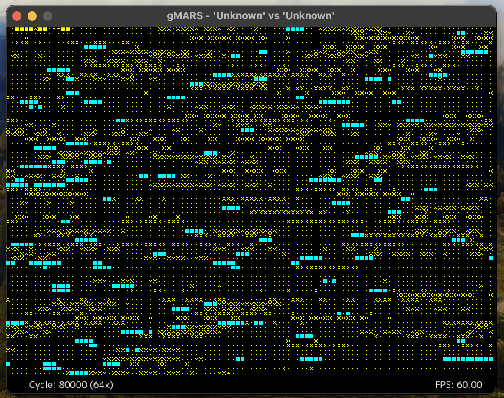

# gMARS

[](https://pkg.go.dev/github.com/bobertlo/gmars/)
[](https://goreportcard.com/report/github.com/bobertlo/gmars)

gMARS is an implementation of a Core War Memory Array Redcode Simulator (MARS)
written in Go.



In the the game of Core War, two virus-like programs written in assembly fight
against each other in the memory of a Simulator where they are able to write and
execute new code and modify eachother. For more information about Core War see:

- [Wikipedia](https://en.wikipedia.org/wiki/Core_War): CoreWar entry
- [corewar.co.uk](https://corewar.co.uk/): John Metcalf's Core War Site with
   tutorials, history, and links.
- [KOTH.org](http://www.koth.org/): A King of the Hill server with ongoing
   competitive matches, information, and links.
- [Koenigstuhl](https://asdflkj.net/COREWAR/koenigstuhl.html): An 'infinite
   hill' site that collects warriors and publishes their rankings and source
   code.

## Why another MARS?

gMARS was created to provide a reference implementation of a MARS in Go. There
are many other implementations but I wanted to meet the following requirements:

1. A thread-safe library implementing the MARS mechanics.
2. Strong compliance to standards, with R/W limits and '88 rules enforcment.
3. Reporting hooks to support custom front-ends and analysis.
4. A modern visual simulator.

## Running the Simulator

Currently only two warrior matches are supported and the warrior files must be
supplied as command line arguments. Both versions also accept the following
arguments

```
  -8    Enforce ICWS'88 rules
  -F int
        fixed position of warrior #2
  -c int
        Cycles until tie (default 80000)
  -debug
        Dump verbose debug information
  -l int
        Max. warrior length (default 100)
  -p int
        Max. Processes (default 8000)
  -r int (CLI only)
        Rounds to play (default 1)
  -s int
        Size of core (default 8000)
```

### Visual MARS Controls

- `Space` to start/pause the simulation
- `Up/Down` to increase or decrease simulation speed
- `Left/Right` to stop or step forward one frame of the simulation (at the
   visualizer speed)
- `R` to reset the simulator with the next starting position
- `Escape` to quit

### CLI MARS

When the simulation completes in the gmars CLI, a line is printed for each
warrior with the number of wins and ties:

```
1 0
0 0 
```

## Install

You can use `go install` to build and install the executables from the latest
release:

```
# vmars - Visual MARS simulator
go install github.com/bobertlo/gmars/cmd/vmars@latest

# gmars - command line MARS
go install github.com/bobertlo/gmars/cmd/gmars@latest
```

## Components

- `cmd/gmars` is a command line interface to run simulations and report results.
- `cmd/vmars` is a graphical simulator with interactive controls.

## Implemented Features

- Load code (compiled assembly) warrior loading for ICWS'88 and '94 standards
   (without p-space)
- Simulation of two warrior battles
- Read/write limits (implemented, but not thoroughly tested)
- Hooks generating updates for visualization and analysis
- Visual MARS with interactive keyboard controls

## Planned Features

- P-Space support
- Parsing and linking of full '94 assembly spec (and pMARS compatibility)
- Interactive debugger

## Testing Status / Known Bugs

> TL;DR: One warrior out of 1695 tested has divergent behavior from pMARS
> detected and I am searching for the issue.

To test for errors I used the 88 and 94nop hills from
[Koenigstuhl](https://asdflkj.net/COREWAR/koenigstuhl.html) and ran battles with
fixed starting positions to compare the output to pMARS and other
implementations.

## Results

The '88 hill has 658 warriors and all tested combinations / starting position
results matched.

The '94 hill has 1037 and all warriors had results matching pMARS except for
one. I am working on finding the bug there, but also working on new features at
the same time.
